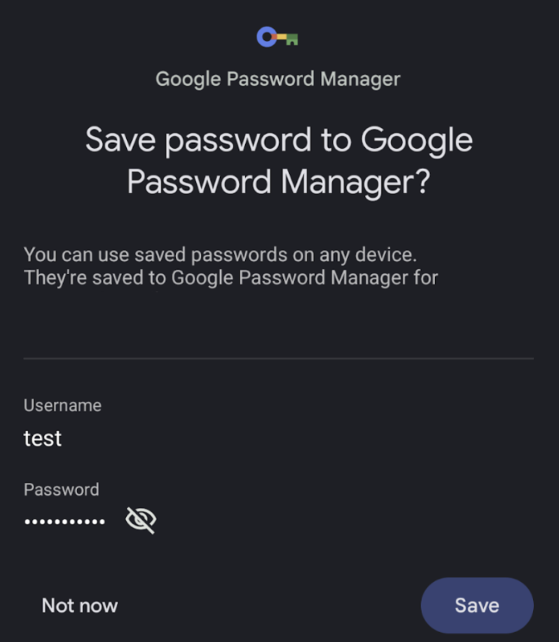

# **Compose におけるパスワード自動入力とパスワード保存**

---

## 話すこと

1. Jetpack Composeでの自動入力の実装方法
  - 自動入力とは？
  - 従来のXML方式との違い
  - 自動入力の種類（保存済みパスワード・新規パスワード）
2. パスワード保存の罠と解決策

---

## 話さないこと

- パスワードマネージャーの導入方法

---

## 登壇者情報
- トニオ（[@tonionagauzzi](https://x.com/tonionagauzzi)）
- Androidエンジニア
- サイボウズ株式会社 kintone開発チーム
- [ブログ](https://dribit.hatenablog.com/)書くのが趣味


---

## 1. Jetpack Composeでの自動入力の実装方法

---

## 自動入力とは？

- パスワード入力欄にカーソルを当てると自動でパスワードを入れてくれる機能
- ユーザーの入力を効率化、セキュリティ面も強化できる

---

### Google パスワードマネージャーによるパスワード自動入力<sup>[1](https://www.android.com/intl/ja_jp/articles/176/#sub-section-4-3)</sup>


---

### Google パスワードマネージャーによる強力なパスワードの自動生成<sup>[2](https://www.android.com/intl/ja_jp/articles/176/#sub-section-4-4)</sup>


---

## XML方式での実装方法

```xml
<EditText
    android:id="@+id/password"
    android:layout_width="match_parent"
    android:layout_height="wrap_content"
    android:inputType="textPassword"
    android:autofillHints="password" />
```

- `android:autofillHints`プロパティで簡単に実装可能

---

## Compose での実装方法

- Compose UI 1.8.0以降がおすすめ
  - [2025/4/23 に正式リリース](https://developer.android.com/jetpack/androidx/releases/compose-ui?hl=ja#1.8.0)

```kotlin
// build.gradle.kts(:app)
dependencies {
    implementation("androidx.compose.ui:ui:1.8.0")
}
```
  - 1.7.x以下では`AutofillType`（deprecated）を使う必要あり
    - 実験的APIで正常に機能しないことも

---

## Composeでの自動入力実装

```kotlin
// SomeComposable.kt
Column {
    TextField(
        value = username.value,
        onValueChange = {username.value = it},
        modifier = Modifier.semantics { contentType = ContentType.Username }
    )
    TextField(
        value = password.value,
        onValueChange = {password.value = it},
        modifier = Modifier.semantics { contentType = ContentType.Password }
    )
}
```

- [公式ドキュメント](https://developer.android.com/develop/ui/compose/text/autofill?hl=ja)を参考に、`Modifier.semantics { contentType = }`で実装

---

## 保存済みパスワードの自動入力

- ログイン画面などのユースケース
- `ContentType.Username` + `ContentType.Password` の組み合わせ
- ユーザー名に応じたパスワードを自動入力


---

## 新しいパスワードの自動生成

- パスワード再設定画面などのユースケース
- `ContentType.NewPassword` を使用
- 強力なパスワードを自動生成して提案

```kotlin
TextField(
    value = newPassword.value,
    onValueChange = {newPassword.value = it},
    modifier = Modifier.semantics { contentType = ContentType.NewPassword }
)
```


---

## パスワード保存機能の実装

[公式ドキュメント](https://developer.android.com/develop/ui/compose/text/autofill?hl=ja#save-data-explicit)では `autofillManager?.commit()` を使う方法が紹介されている

```kotlin
val autofillManager = LocalAutofillManager.current

〜省略〜

Button(onClick = { autofillManager?.commit() }) { 
    Text("Reset credentials") 
}
```

---

## 2. パスワード保存の罠と解決策

---

## AutoFillManagerの罠

`autofillManager?.commit()` を呼んでもパスワード保存ダイアログが表示されない！



---

## 原因（厳しい条件）

Composeのパスワード自動保存には厳しい条件がある：

1. **NewUsernameとNewPasswordの両方が1つのComposable内に存在**
2. **ユーザーが1.の両方を操作した**

これらを満たさない場合、パスワード保存ダイアログは表示されない。
- [参考: Google Issue Tracker](https://issuetracker.google.com/issues/176949051#comment60)

---

## 解決策：CredentialManagerを使う

```kotlin
Button(onClick = {
    coroutineScope.launch {
        val credentialManager = CredentialManager.create(context)
        val request = CreatePasswordRequest(username, newPassword.value)
        credentialManager.createCredential(
            request = request,
            context = context,
        )
    }
}) { Text("Reset credentials") }
```

---

## CredentialManagerの注意点

- `android.credentials` (API Level 34以上)
- `androidx.credentials` (下位互換性あり)

API Level 33以下をサポートする場合は [androidx.credentials](https://developer.android.com/jetpack/androidx/releases/credentials?hl=ja) を使用

```
// build.gradle.kts(:app)
dependencies {
    implementation("androidx.credentials:credentials:1.5.0")

    // optional - needed for credentials support from play services, for devices running
    // Android 13 and below.
    implementation("androidx.credentials:credentials-play-services-auth:1.5.0")
}
```

---

## まとめ

- Compose UIでの自動入力は `contentType` で簡単に実装可能
- パスワード保存は `AutofillManager` より `CredentialManager` が確実
- 適切な実装でユーザー体験を向上させよう

---

## 参考リンク

- [スマホでパスワード管理ができる Google パスワード マネージャーの使い方](https://www.android.com/intl/ja_jp/articles/176/)
- [Composeでのテキスト自動入力](https://developer.android.com/develop/ui/compose/text/autofill?hl=ja)
- [Autofill フレームワーク](https://developer.android.com/guide/topics/text/autofill?hl=ja)
- [CredentialManager API](https://developer.android.com/jetpack/androidx/releases/credentials) 
