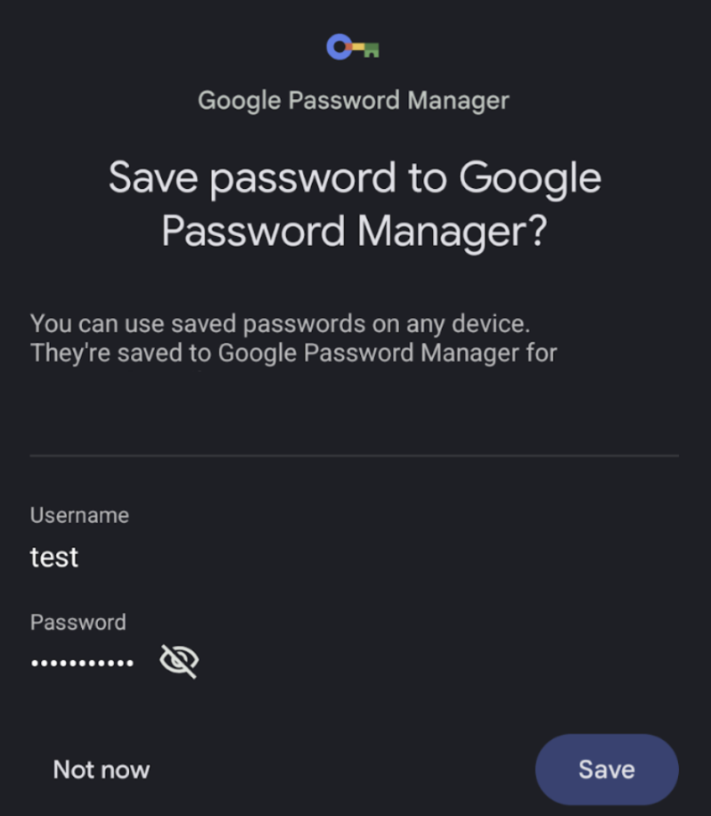

# 【Android】Jetpack Composeでandroid:autofillHintsのような自動入力を有効にするには？

自動入力またはオートフィルとは、**パスワード入力欄にカーソルを当てると保存済みもしくは生成したパスワードを自動で入力してくれる機能**です。

[https://mobilelaby.com/blog-entry-how-to-use-autofill-android-oreo.html#google_vignette:embed:cite]

従来のXML型Android Viewでは、`android:autofillHints`プロパティを使って自動入力の実装が簡単にできました((https://developer.android.com/identity/autofill/autofill-optimize?hl=ja#important))。

しかし、Jetpack Composeではどうやって自動入力の実装をすればいいのかわからなくて、今回調べて知ったことを記事にまとめました。

## Jetpack Composeの自動入力

Jetpack Composeで自動入力を有効化するには、Compose UIを1.8.0以降に上げるのがおすすめです((https://developer.android.com/jetpack/androidx/releases/compose-ui?hl=ja#1.8.0-alpha05))。

Compose UI 1.7.x以下でもAutofillTypeのようなAPIがあるので、アプリ側で頑張れば自動入力を実装できるかもしれません((https://developer.android.com/reference/kotlin/androidx/compose/ui/autofill/AutofillType))。ただし、AutofillTypeは実験的なAPIで、これを使って実装してもうまく機能しないという情報があります((https://issuetracker.google.com/issues/261422380))。そして、AutofillTypeは1.8.0でdeprecatedとなっています。

よって、実装の手軽さを考慮するとCompose UIを1.8.0以降に上げるのが確実だと思います。

### 対応手順
#### 1. Compose UIのバージョンアップ

```Kotlin
// build.gradle.kts(:app)
dependencies {
    implementation("androidx.compose.ui:ui:1.8.0-beta03")
}
```

Compose UIを1.8.0に上げます。記事執筆時点ではベータ版で、beta02以前には既知の問題があるため、beta03にします((https://issuetracker.google.com/issues/395911609?hl=ja))。

#### 2. TextFieldに`contentType`を設定

##### 保存済みパスワードを自動入力する場合

ログイン画面のように、ユーザー名に応じてパスワードを自動入力して欲しい場合、以下のように`Modifier.semantics`を使って`contentType`を指定します。

```Kotlin
Column {
    TextField(
        value = username.value,
        onValueChange = {username.value = it},
        modifier = Modifier.semantics { contentType = ContentType.Username }
    )
    TextField(
        value = password.value,
        onValueChange = {password.value = it},
        modifier = Modifier.semantics { contentType = ContentType.Password }
    )
}
```

すると、これだけでパスワード入力欄にカーソルが移るとユーザー名に応じた保存済みパスワードを自動入力してくれます。


なお、端末側では自動入力の設定を有効にする必要があります。((https://developer.android.com/develop/ui/compose/text/autofill?hl=ja#set-autofill))。

##### 新しいパスワードを自動生成する場合

パスワード再設定画面のように、新しいパスワードを自動生成したい場合、以下のように`contentType`に`ContentType.NewPassword`を指定します。

```Kotlin
Column {
    TextField(
        value = newPassword.value,
        onValueChange = {newPassword.value = it},
        modifier = Modifier.semantics { contentType = ContentType.NewPassword }
    )
    TextField(
        value = newPasswordToConfirm.value,
        onValueChange = {newPasswordToConfirm.value = it},
        modifier = Modifier.semantics { contentType = ContentType.NewPassword }
    )
}
```

すると、パスワード入力欄にカーソルが移ると新しいパスワードを自動生成して提案してくれます。自動生成したパスワードは、2つのTextFieldに同時に入れてくれます。


## まとめ

この記事では、Jetpack Composeで自動入力を有効にする方法を説明しました。contentTypeの指定だけで自動入力を有効化できるなんて便利ですね！

詳細は以下のドキュメントに書かれています。

[https://developer.android.com/develop/ui/compose/text/autofill?hl=ja:title]

# 【Android】Jetpack ComposeのTextFieldに入力されたパスワードを保存するには？

## やりたいこと
今回は、**Composeに一度入力したパスワードを保存するようにしたい**です。以下のように`autofillManager`を使う手が公式ドキュメントに紹介されています((https://developer.android.com/develop/ui/compose/text/autofill?hl=ja#save-data-explicit))。

以下の実装を行います。要点は`autofillManager?.commit()`です。

```kotlin
val autofillManager = LocalAutofillManager.current

Column {
    TextField(
        value = newUsername.value,
        onValueChange = { newUsername.value = it },
        modifier = Modifier.semantics { contentType = ContentType.NewUsername },
    )

    Spacer(modifier = Modifier.height(16.dp))

    TextField(
        value = newPassword.value,
        onValueChange = { newPassword.value = it },
        modifier = Modifier.semantics { contentType = ContentType.NewPassword },
    )

    // Submit button
    Button(onClick = { autofillManager?.commit() }) { Text("Reset credentials") }
}
```

## AutoFillManagerの罠

ところが、上記を動かして`autofillManager?.commit()`が呼ばれても、以下のパスワード保存ダイアログが出てきませんでした。



パスワードの保存はユーザー操作が必要なので、ダイアログが出なければ、当然、自動入力の設定((https://developer.android.com/develop/ui/compose/text/autofill?hl=ja#set-autofill))を見てもパスワードは保存されていません。

なぜAutofillManagerを使ってもパスワードを保存できないのか、調べてみると意外な理由でした。

### Composeのパスワード自動保存は条件が厳しい！

[https://t.co/porCeADo0K:title]で情報を見つけましたが、`autofillManager?.commit()`でパスワード保存ダイアログが出るには、以下の条件があるようです。

1. **NewUsernameとNewPasswordの両方が1つのComposable内にあること**
2. **ユーザーが1.の両方を操作したこと**

例えばユーザー名がデフォルトで入っていてユーザーが変えなかったたり、パスワード入力欄しか無いComposableを出した場合だと、AutofillManagerは使えません。

ユーザーが毎回ユーザー名を変えるとは限らないし、デザイン的な事情もあるので、AutofillManagerを使うのは諦めたほうがよさそうです。

ではどうするか。調べてみると、[https://issuetracker.google.com/issues/176949051#comment63:title]の続きに、**CredentialManagerを使う方法**が提案されていました。

試しに前述のコードを以下のように書き換えてみました。

```kotlin
Column {
    val context = LocalContext.current
    val coroutineScope = rememberCoroutineScope()

    TextField(
        value = newPassword.value,
        onValueChange = { newPassword.value = it },
        modifier = Modifier.semantics { contentType = ContentType.NewPassword },
    )

    // Submit button
    Button(onClick = {
        try {
            coroutineScope.launch {
                val credentialManager = CredentialManager.create(context)
                val request = CreatePasswordRequest(username, newPassword.value)
                credentialManager.createCredential(
                    request = request,
                    context = context,
                )
            }
        } catch (e: CreateCredentialException) {
            println("❌ Failed to save password: ${e.message}")
        }
    }) { Text("Reset credentials") }
}
```
この方法で試すと、ボタンを押したときに無事パスワード保存ダイアログが表示されました。ダイアログでパスワードを保存すると、**次回の認証時に新しいパスワードが自動入力される**ことも確認できました！

## CredentialManagerを使う際の注意点

ちなみに、CredentialManagerは`android.credentials`と`androidx.credentials`の2種類があります。AndroidアプリがAPI Level 33以下をサポートしている場合、後者の`androidx.credentials`を使ったほうがよいです。`android.credentials`はAPI Level 34以上向けだからです。`androidx.credentials`をインポートするには、[androidx.credentials:credentialsを依存関係に追加する](https://developer.android.com/jetpack/androidx/releases/credentials)必要があります。
