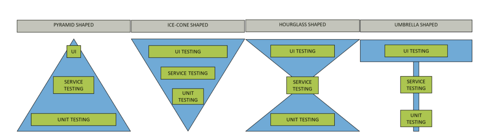
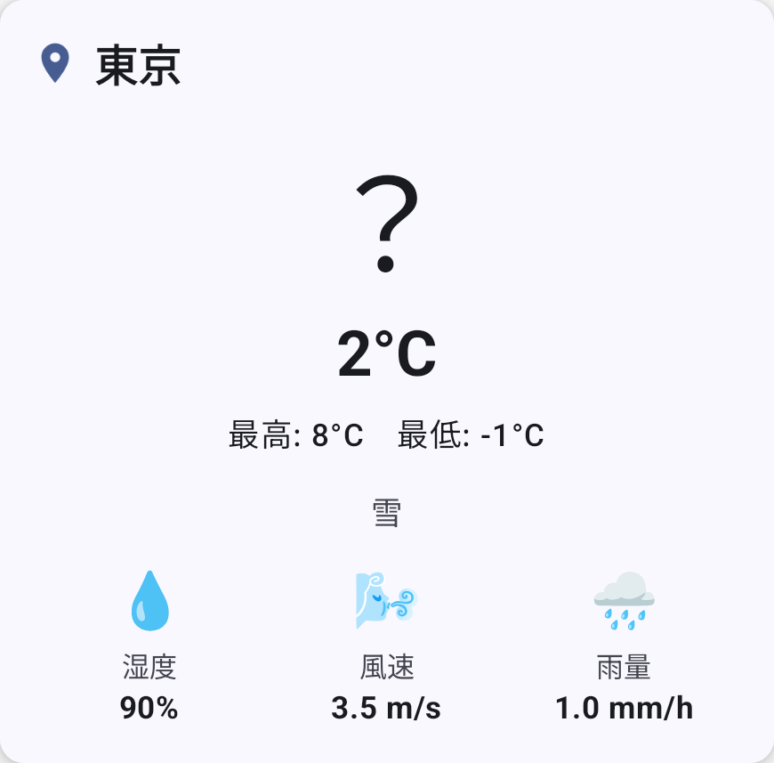
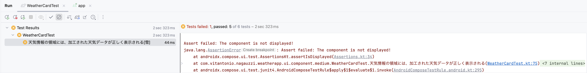
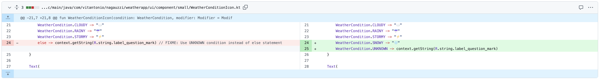
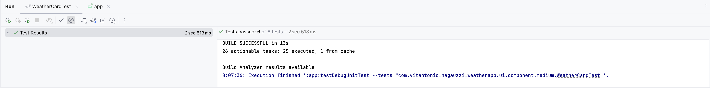
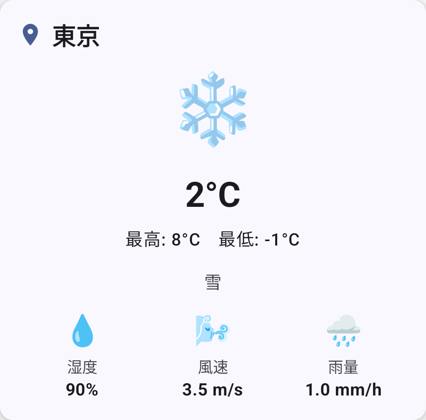
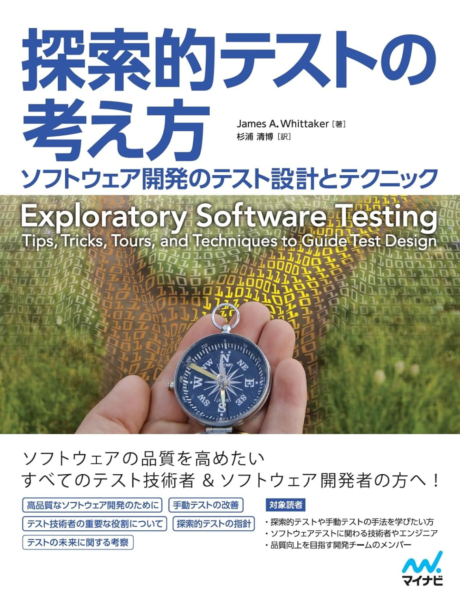
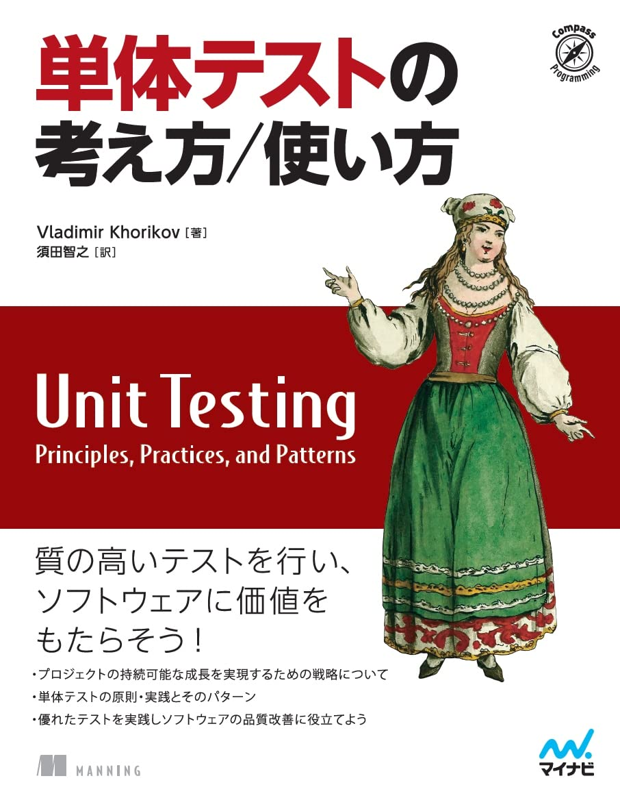

# Androidテスト基礎講義

---

## 登壇者情報
- トニオ（[@tonionagauzzi](https://x.com/tonionagauzzi)）
- Androidエンジニア
- 趣味は[ブログ](https://dribit.hatenablog.com/)

---

## 目次
1. テストの種類
  1-1. テストのスコープ
  1-2. テストのサイズ
  1-3. テストの分布
  1-4. テストダブル
2. Androidのテストを知る
  2-1. Androidテストの実行場所
  2-2. Androidテストのツール
3. なぜテストが必要か、失敗事例から知る
4. ワークショップ「もし、テストが不十分だったら…」

---

## 1. テストの種類

---

### 1-1. テストのスコープ
- ユニットテスト
  - メソッドやクラスなどが対象
- インテグレーションテスト
  - 2つ以上のユニット間の統合部分が対象
- E2Eテスト、UIテスト
  - ユーザーシナリオや画面全体が対象

図：[Android アプリのテストの基礎](https://developer.android.com/training/testing/fundamentals?hl=ja#scope)

---

### 1-2. テストのサイズ

- 小規模
  - 単一プロセス
- 中規模
  - 単一マシン
- 大規模
  - 制約なし

参考：[【t-wada】自動テストの「嘘」をなくし、望ましい比率に近づける方法【Developer eXperience Day 2024 レポート】](https://levtech.jp/media/article/column/detail_496/#:~:text=%E3%83%86%E3%82%B9%E3%83%88%E3%81%AB%E3%81%AF%E3%80%8C%E3%82%B5%E3%82%A4%E3%82%BA%E3%80%8D%E3%81%8C%E3%81%82%E3%82%8A%E3%81%BE%E3%81%99%E3%80%82%E3%82%B9%E3%83%A2%E3%83%BC%E3%83%AB%E3%80%81%E3%83%9F%E3%83%87%E3%82%A3%E3%82%A2%E3%83%A0%E3%80%81%E3%83%A9%E3%83%BC%E3%82%B8%E3%80%82)

---

### 1-3. テストの分布

**問1：どれが最もバランスの取れたテスト配分でしょうか？**

図：[Test Automation Strategy Syllabus - ISTQB](https://www.bcs.org/media/xiqglmbk/istqb-test-automation-strategy-syllabus.pdf)

横軸はテストの実行数。

---

### 1-4. テストダブル

- フェイク、モック、スタブ、スパイ、ダミー、シャドウ
  - 詳細：[Android でテストダブルを使用する](https://developer.android.com/training/testing/fundamentals/test-doubles?hl=ja)
- Android公式は**フェイクを強く推奨**
  - 詳細：[Android アーキテクチャに関する推奨事項](https://developer.android.com/topic/architecture/recommendations?hl=ja#testing)
- フェイクは本物の実装と同様に振る舞う
  - フレームワークを必要としない
  - 書くのに労力はかかるが、修正の影響を受けやすいので保守に強い
  - 忠実性の担保が大事
- モックはフレームワークで本物を模倣して振る舞う
  - 少ないコードで書けるが、修正の影響を受けにくいので保守に弱い

---

## 2. Androidのテストを知る

---

### 2-1. Androidテストの実行場所

- 開発マシン、Androidでないサーバー
  - ローカルテストに向いている
  - 小〜中規模テストに向いている
  - 実行速度と決定性が高い
- 実機、エミュレーター
  - インストルメンテーションテスト、E2Eテストに向いている
  - 中〜大規模テストに向いている
  - 忠実性が高い

---

### 2-2. Androidテストのツール
- [JUnit4](https://developer.android.com/training/testing/local-tests)：Javaベースの標準的なテストフレームワーク
  - [AndroidJUnitRunner](https://developer.android.com/training/testing/instrumented-tests/androidx-test-libraries/runner)：Androidデバイス上でJUnitテストを実行するランナー
  - [JUnit Rules](https://developer.android.com/training/testing/instrumented-tests/androidx-test-libraries/rules)：テストの開始/終了処理を共通化できる
- [Robolectric](https://developer.android.com/training/testing/local-tests/robolectric)：実機を使わずAndroidコンポーネントをテストできる
- [Compose UIテスト](https://developer.android.com/develop/ui/compose/testing)：Jetpack Composeで構築されたUIをテストできる
- [Espresso](https://developer.android.com/training/testing/espresso)：AndroidアプリのUIと操作をテストできる
- [UI Automator](https://developer.android.com/training/testing/other-components/ui-automator)：AndroidアプリのUIと操作をテストできる（他アプリも操作可能）
- [Screenshot Testing](https://developer.android.com/studio/preview/compose-screenshot-testing)：UIの変化の有無を自動で検出できる
- [MockK](https://mockk.io/)：Kotlinのモッキングフレームワーク

---

## 3. なぜテストが必要か、失敗事例から知る

---

### 3-1. 個人的な話

- 「テスト無くていいじゃん！動いてるし！！」
→ 環境の違いで重大バグ発生。ユーザー企業へ謝りに行った。
- 「機種ごとに違うんだ。新機種が出るたびに"手動"で検証しよう！」
→ 莫大な費用と時間を費やした。

---

### 3-2. Googleウェブサーバーの物語

- Googleウェブサーバーの規模と複雑性の膨張による生産性の劇的な低下
- リリースはバグを含むようになり本番で初めて見つかることも

---

### 補足：プロジェクトのテストとプロダクトのテストの違い

- プロジェクト：明確な終わりがある、目標は成果物の納品
  - テストの目的は、**納品を成功させる**こと
- プロダクト：明確な終わりはない、目標はユーザー価値の最大化や持続すること
  - テストの目的は、**プロダクト継続におけるリスクを最小化する**こと

---
## 4. ワークショップ「もし、テストが不十分だったら…」

---

**問2：晴れ、曇り、雨を取得できる"WeatherApp"を、雪に対応してください。**

https://github.com/tonionagauzzi/WeatherApp

---

### テストが無い場合
[解答](https://github.com/tonionagauzzi/WeatherApp/pull/42/commits/be2ed1b7ac4afddee86e5bebf95b14087cf2f561)

- 「雪のステータスコードに対応、文言も追加した。ヨシ！！」
- そして、雪が降った。

- 雪のマークが出なかった！！

---

### テストがある場合

[解答](https://github.com/tonionagauzzi/WeatherApp/pull/42/files/dc8bfa3bf3b3ec98fc7dd0d0cf80e4938b549044)

- 「雪のステータスコードに対応、文言も追加した。ヨシ！！」
- でも、テストが通っていない…❌

- 「修正しよう！」

---

- テストが通るようになった！✅

- そして、雪が降った。

- 問題なく表示された！

---

## さいごに

> - 自動テストは、テストのタスク全てに適しているわけではない。
> - よく理解されている挙動を扱うために自動テストを用いると、人間のテスターの高コストかつ定性的な労力を、人間のテスターが最大の価値を提供できる製品部位に集中させることができる。
> （『Googleのソフトウェアエンジニアリング』、オライリージャパン、268-269頁、2021年）

---

### 補足：参考情報
- [Androidでアプリをテストする](https://developer.android.com/training/testing)
- [Android Studioでテストする](https://developer.android.com/studio/test/test-in-android-studio)
- [テスト戦略](https://developer.android.com/training/testing/fundamentals/strategies)
- [【動画】開発生産性の観点から考える自動テスト](https://www.youtube.com/watch?v=ueqjypYJnxk)

---

### 補足：テストを学べるおすすめ本5選
    
